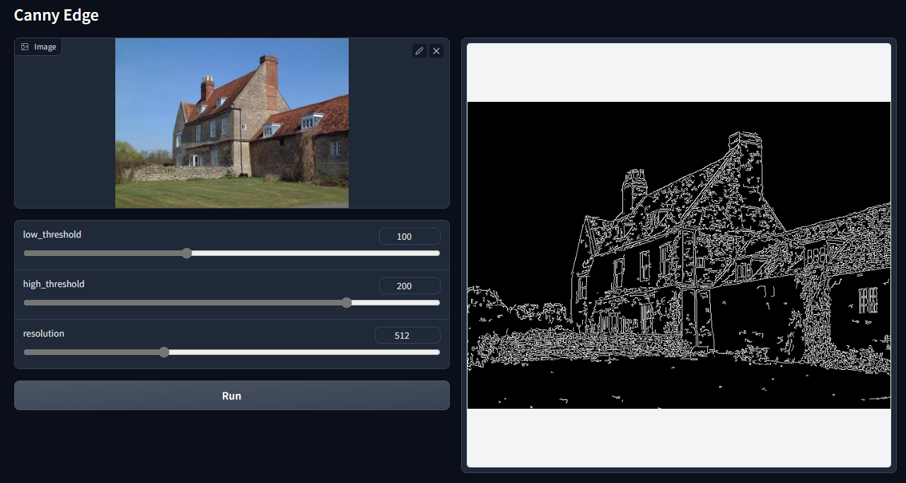
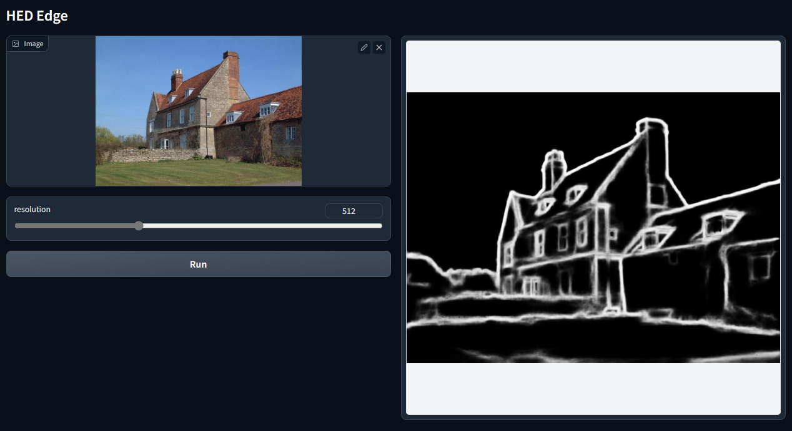
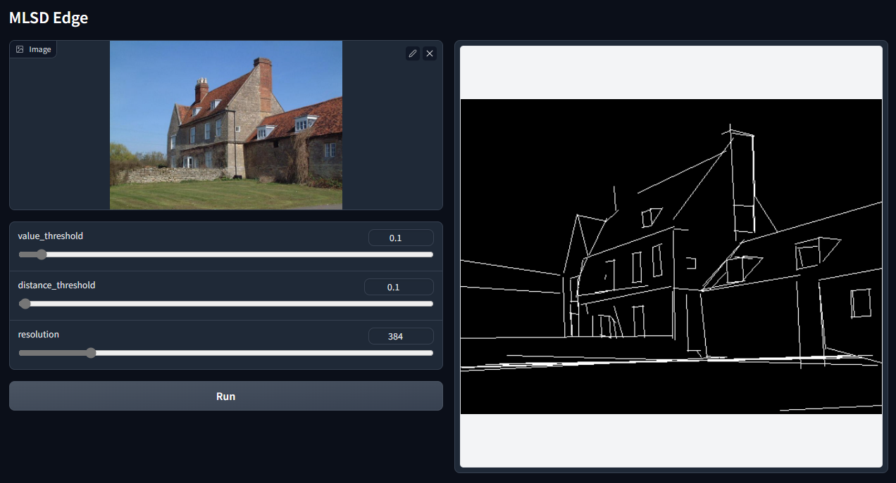
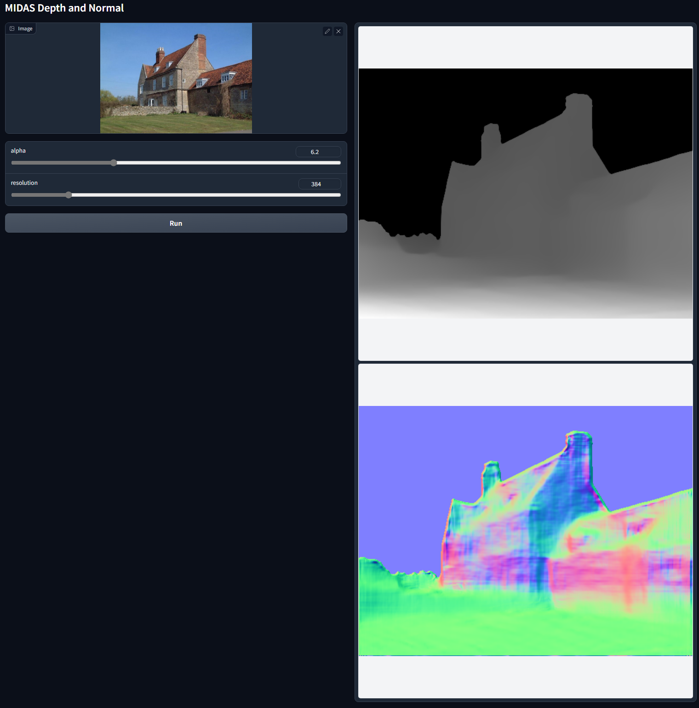
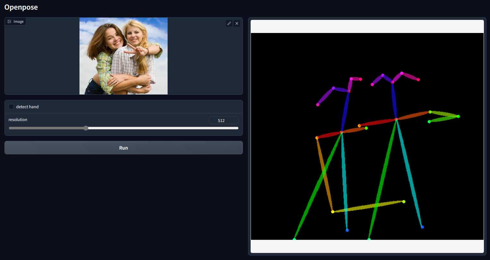
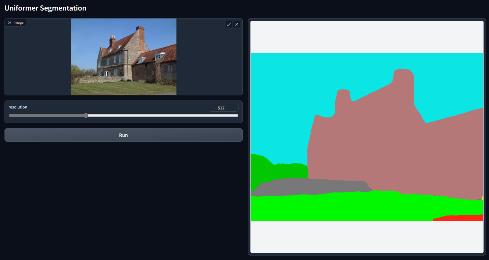

# Automatic Annotations

We provide gradio examples to obtain annotations that are aligned to our pretrained production-ready models.

Just run

    python gradio_annotator.py

Since everyone has different habit to organize their datasets, we do not hard code any scripts for batch processing. But "gradio_annotator.py" is written in a super readable way, and modifying it to annotate your images should be easy.

In the gradio UI of "gradio_annotator.py" we have the following interfaces:

### Canny Edge

Be careful about "black edge and white background" or "white edge and black background".

### HED Edge

Be careful about "black edge and white background" or "white edge and black background".

### MLSD Edge

Be careful about "black edge and white background" or "white edge and black background".

### MIDAS Depth and Normal

Be careful about RGB or BGR in normal maps.

### Openpose

Be careful about RGB or BGR in pose maps.

For our production-ready model, the hand pose option is turned off.

### Uniformer Segmentation

Be careful about RGB or BGR in segmentation maps.

