# Train a ControlNet to Control SD

You are here because you want to control SD in your own way, maybe you have an idea for your perfect research project, and you will annotate some data or have already annotated your own dataset automatically or manually. Herein, the control can be anything that can be converted to images, such as edges, keypoints, segments, etc.

Before moving on to your own dataset, we highly recommend to first try the toy dataset, Fill50K, as a sanity check. This will help you get a "feeling" for the training. You will know how long it will take for the model to converge and whether your device will be able to complete the training in an acceptable amount of time. And what it "feels" like when the model converges.

We hope that after you read this page, you will find that training a ControlNet is as easy as (or easier than) training a pix2pix.

## Step 0 - Design your control

Let us take a look at a very simple task to control SD to fill color in circles.

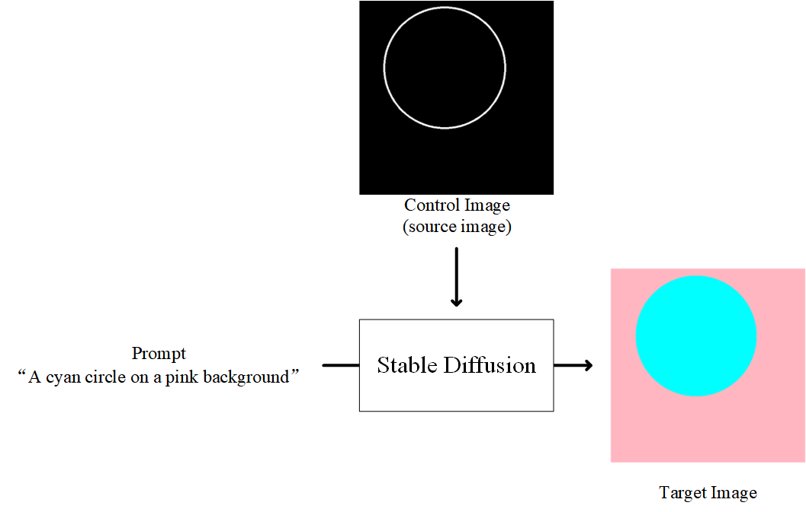

This is simple: we want to control SD to fill a circle with colors, and the prompt contains some description of our target.

Stable diffusion is trained on billions of images, and it already knows what is "cyan", what is "circle", what is "pink", and what is "background".

But it does not know the meaning of that "Control Image (Source Image)". Our target is to let it know.

## Step 1 - Get a dataset

Just download the Fill50K dataset from [our huggingface page](https://huggingface.co/lllyasviel/ControlNet) (training/fill50k.zip, the file is only 200M!). Make sure that the data is decompressed as 

    ControlNet/training/fill50k/prompt.json
    ControlNet/training/fill50k/source/X.png
    ControlNet/training/fill50k/target/X.png

In the folder "fill50k/source", you will have 50k images of circle lines.

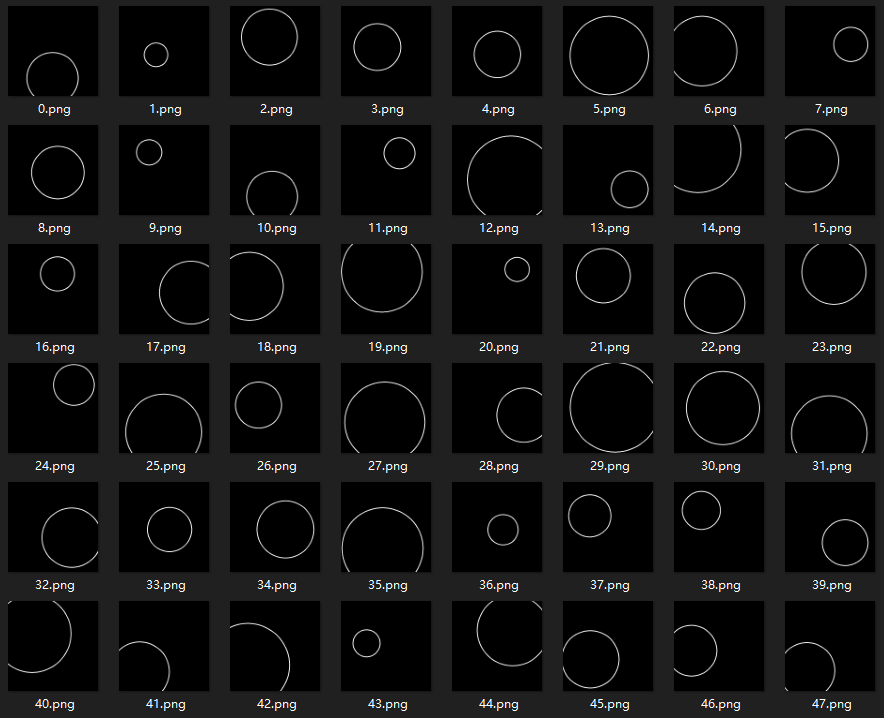

In the folder "fill50k/target", you will have 50k images of filled circles.

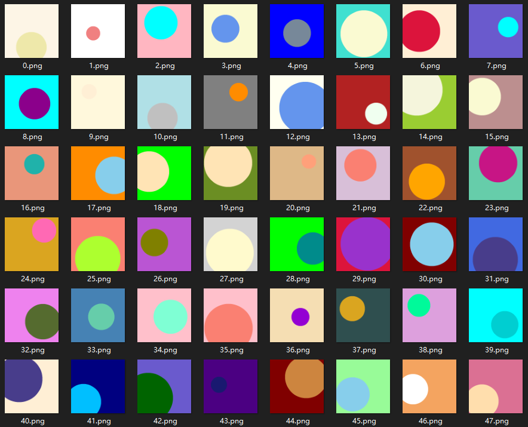

In the "fill50k/prompt.json", you will have their filenames and prompts. Each prompt is like "a balabala color circle in some other color background."

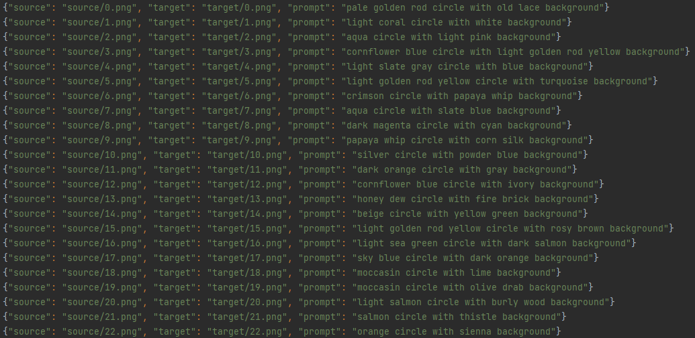

## Step 2 - Load the dataset

Then you need to write a simple script to read this dataset for pytorch. (In fact we have written it for you in "tutorial_dataset.py".)

```python
import json
import cv2
import numpy as np

from torch.utils.data import Dataset


class MyDataset(Dataset):
    def __init__(self):
        self.data = []
        with open('./training/fill50k/prompt.json', 'rt') as f:
            for line in f:
                self.data.append(json.loads(line))

    def __len__(self):
        return len(self.data)

    def __getitem__(self, idx):
        item = self.data[idx]

        source_filename = item['source']
        target_filename = item['target']
        prompt = item['prompt']

        source = cv2.imread('./training/fill50k/' + source_filename)
        target = cv2.imread('./training/fill50k/' + target_filename)

        # Do not forget that OpenCV read images in BGR order.
        source = cv2.cvtColor(source, cv2.COLOR_BGR2RGB)
        target = cv2.cvtColor(target, cv2.COLOR_BGR2RGB)

        # Normalize source images to [0, 1].
        source = source.astype(np.float32) / 255.0

        # Normalize target images to [-1, 1].
        target = (target.astype(np.float32) / 127.5) - 1.0

        return dict(jpg=target, txt=prompt, hint=source)

```

This will make your dataset into an array-like object in python. You can test this dataset simply by accessing the array, like this

```python
from tutorial_dataset import MyDataset

dataset = MyDataset()
print(len(dataset))

item = dataset[1234]
jpg = item['jpg']
txt = item['txt']
hint = item['hint']
print(txt)
print(jpg.shape)
print(hint.shape)

```

The outputs of this simple test on my machine are 

    50000
    burly wood circle with orange background
    (512, 512, 3)
    (512, 512, 3)

And this code is in "tutorial_dataset_test.py".

In this way, the dataset is an array-like object with 50000 items. Each item is a dict with three entry "jpg", "txt", and "hint". The "jpg" is the target image, the "hint" is the control image, and the "txt" is the prompt. 

Do not ask us why we use these three names - this is related to the dark history of a library called LDM.

## Step 3 - What SD model do you want to control?

Then you need to decide which Stable Diffusion Model you want to control. In this example, we will just use standard SD1.5. You can download it from the [official page of Stability](https://huggingface.co/runwayml/stable-diffusion-v1-5/tree/main). You want the file ["v1-5-pruned.ckpt"](https://huggingface.co/runwayml/stable-diffusion-v1-5/tree/main).

(Or ["v2-1_512-ema-pruned.ckpt"](https://huggingface.co/stabilityai/stable-diffusion-2-1-base/tree/main) if you are using SD2.)

Then you need to attach a control net to the SD model. The architecture is 


Note that all weights inside the ControlNet are also copied from SD so that no layer is trained from scratch, and you are still finetuning the entire model.

We provide a simple script for you to achieve this easily. If your SD filename is "./models/v1-5-pruned.ckpt" and you want the script to save the processed model (SD+ControlNet) at location "./models/control_sd15_ini.ckpt", you can just run:

    python tool_add_control.py ./models/v1-5-pruned.ckpt ./models/control_sd15_ini.ckpt

Or if you are using SD2:

    python tool_add_control_sd21.py ./models/v2-1_512-ema-pruned.ckpt ./models/control_sd21_ini.ckpt

You may also use other filenames as long as the command is "python tool_add_control.py input_path output_path".

This is the correct output from my machine:

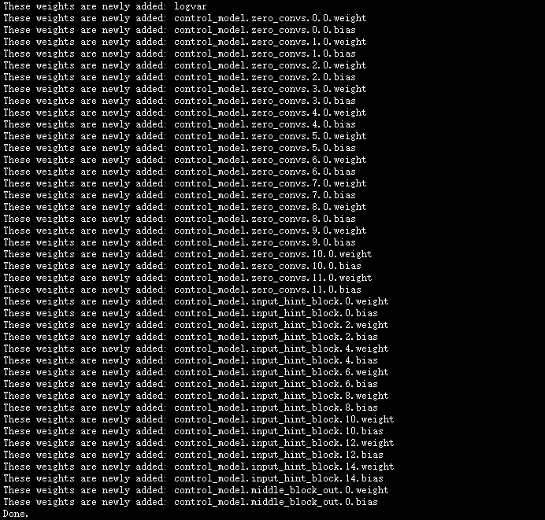

## Step 4 - Train!

Happy! We finally come to the most exciting part: training!

The training code in "tutorial_train.py" is actually surprisingly simple:

```python
import pytorch_lightning as pl
from torch.utils.data import DataLoader
from tutorial_dataset import MyDataset
from cldm.logger import ImageLogger
from cldm.model import create_model, load_state_dict


# Configs
resume_path = './models/control_sd15_ini.ckpt'
batch_size = 4
logger_freq = 300
learning_rate = 1e-5
sd_locked = True
only_mid_control = False


# First use cpu to load models. Pytorch Lightning will automatically move it to GPUs.
model = create_model('./models/cldm_v15.yaml').cpu()
model.load_state_dict(load_state_dict(resume_path, location='cpu'))
model.learning_rate = learning_rate
model.sd_locked = sd_locked
model.only_mid_control = only_mid_control


# Misc
dataset = MyDataset()
dataloader = DataLoader(dataset, num_workers=0, batch_size=batch_size, shuffle=True)
logger = ImageLogger(batch_frequency=logger_freq)
trainer = pl.Trainer(gpus=1, precision=32, callbacks=[logger])


# Train!
trainer.fit(model, dataloader)

```
(or "tutorial_train_sd21.py" if you are using SD2)

Thanks to our organized dataset pytorch object and the power of pytorch_lightning, the entire code is just super short.

Now, you may take a look at [Pytorch Lightning Official DOC](https://pytorch-lightning.readthedocs.io/en/latest/api/pytorch_lightning.trainer.trainer.Trainer.html?highlight=trainer) to find out how to enable many useful features like gradient accumulation, multiple GPU training, accelerated dataset loading, flexible checkpoint saving, etc. All these only need about one line of code. Great!

Note that if you find OOM, perhaps you need to enable [Low VRAM mode](low_vram.md), and perhaps you also need to use smaller batch size and gradient accumulation. Or you may also want to use some “advanced” tricks like sliced attention or xformers. For example:

```python
# Configs
batch_size = 1

# Misc
trainer = pl.Trainer(gpus=1, precision=32, callbacks=[logger], accumulate_grad_batches=4)  # But this will be 4x slower
```

Note that training with 8 GB laptop GPU is challenging. We will need some GPU memory optimization at least as good as automatic1111’s UI. This may require expert modifications to the code.

### Screenshots

The training is fast. After 4000 steps (batch size 4, learning rate 1e-5, about 50 minutes on PCIE 40G), the results on my machine (in an output folder "image_log") is

Control:

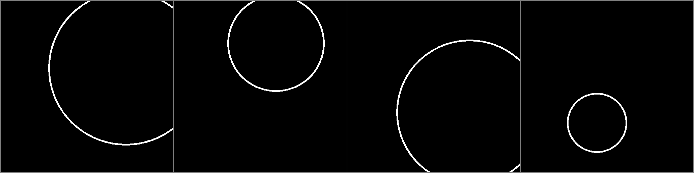

Prompt:

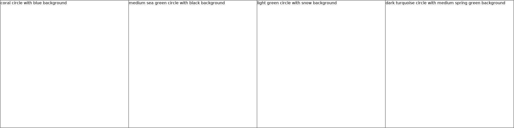

Prediction:

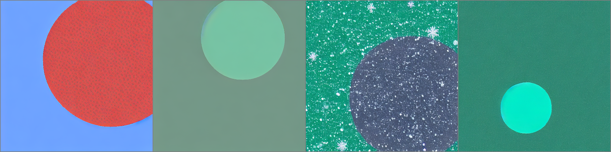

Ground Truth:


Note that the SD's capability is preserved. Even training on this super aligned dataset, it still draws some random textures and those snow decorations. (Besides, note that the ground truth looks a bit modified because it is converted from SD's latent image.)

Larger batch size and longer training will further improve this. Adequate training will make the filling perfect. 

Of course, training SD to fill circles is meaningless, but this is a successful beginning of your story. 

Let us work together to control large models more and more.

## Other options

Beyond standard things, we also provide two important parameters "sd_locked" and "only_mid_control" that you need to know.

### only_mid_control

By default, only_mid_control is False. When it is True, you will train the below architecture.

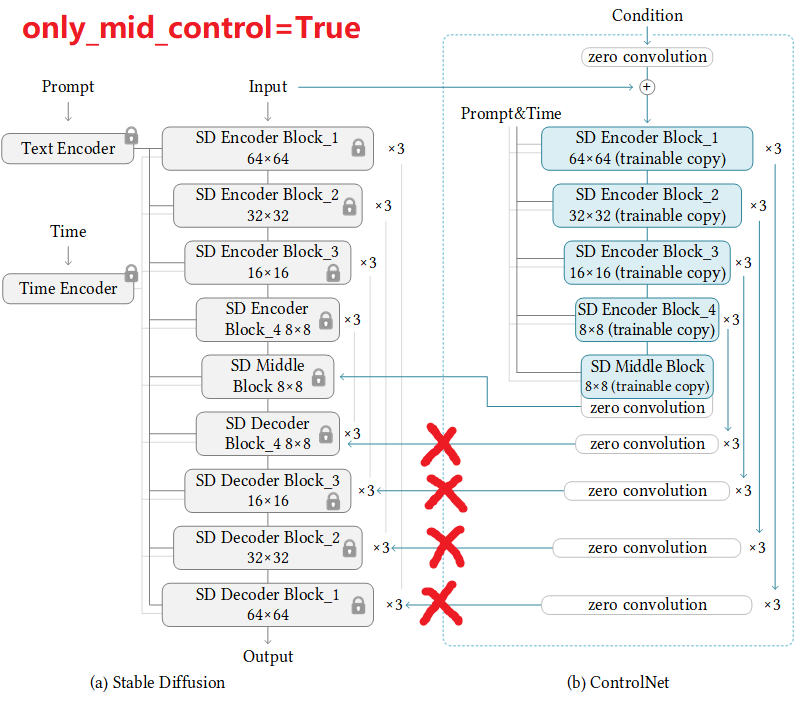

This can be helpful when your computation power is limited and want to speed up the training, or when you want to facilitate the "global" context learning. Note that sometimes you may pause training, set it to True, resume training, and pause again, and set it again, and resume again. 

If your computation device is good, perhaps you do not need this. But I also know some artists are willing to train a model on their laptop for a month - in that case, perhaps this option can be useful.

### sd_locked

By default, sd_locked is True. When it is False, you will train the below architecture.

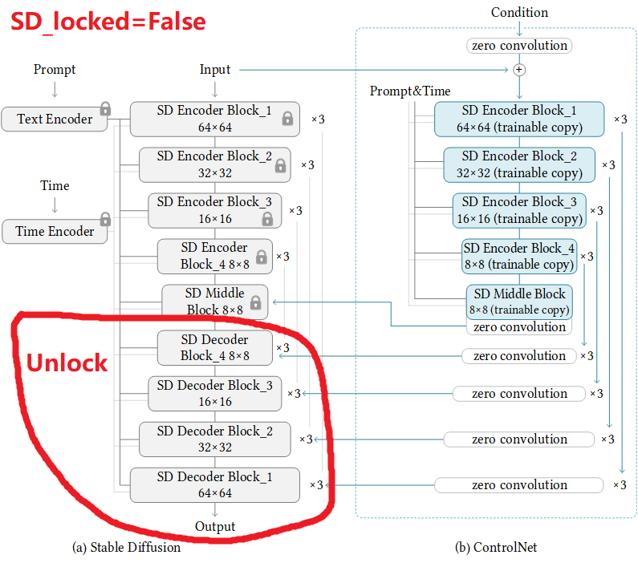

This will unlock some layers in SD and you will train them as a whole.

This option is DANGEROUS! If your dataset is not good enough, this may downgrade the capability of your SD model.

However, this option is also very useful when you are training on images with some specific style, or when you are training with special datasets (like medical dataset with X-ray images or geographic datasets with lots of Google Maps). You can understand this as simultaneously training the ControlNet and something like a DreamBooth.

Also, if your dataset is large, you may want to end the training with a few thousands of steps with those layer unlocked. This usually improve the "problem-specific" solutions a little. You may try it yourself to feel the difference.

Also, if you unlock some original layers, you may want a lower learning rate, like 2e-6.

## Other Considerations: the sudden converge phenomenon and gradient accumulation

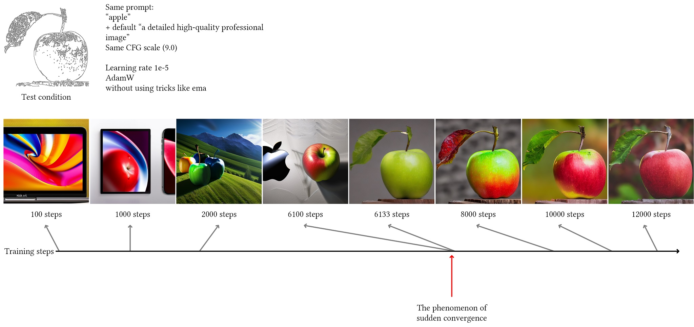

Because we use zero convolutions, the SD should always be able to predict meaningful images. You will always find that at some iterations, the model "suddenly" be able to fit some training conditions. This means that you will get a basically usable model at about 3k to 7k steps (future training will improve it, but that model after the first "sudden converge" should be basically functional).

Note that 3k to 7k steps is not very large, and you should consider larger batch size rather than more training steps. If you can observe the fitting at 3k step, rather than train it with 300k steps, a better idea is to use 100× gradient accumulation to train that 3k steps with 100× batch size. Note that perhaps we should not do this *too* extremely, but you should consider that, since "sudden converge" will always happen at some point, getting a better converge is more important.
